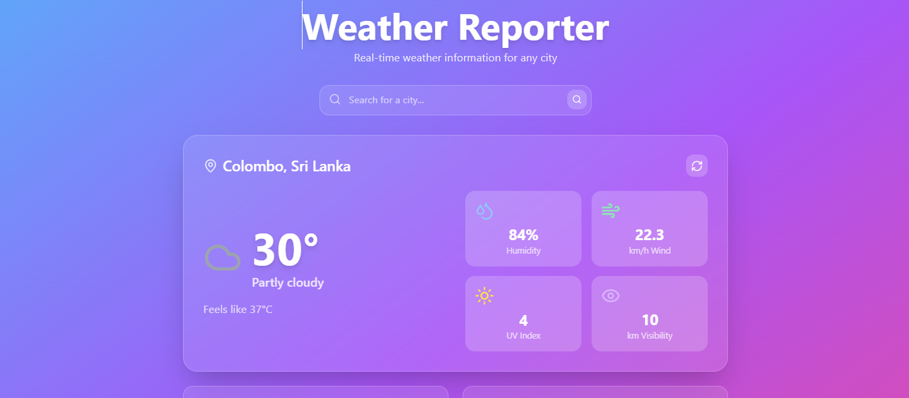

# Weather Reporter 🌦️

A beautiful, responsive weather application built with React and Tailwind CSS that displays current weather conditions for any city worldwide.

 

## Features ✨

- **Current Weather Data**: Temperature, humidity, wind speed, UV index, and more
- **City Search**: Find weather for any location globally
- **Beautiful UI**: User-friendly interface with intuitive design
- **Responsive Design**: Works on all device sizes
- **Weather Icons**: Visual representation of current conditions
- **Quick City Access**: One-click weather for popular cities
- **Auto-refresh**: Manual refresh button for updated data

## Technologies Used 🛠️

- **Frontend**: React
- **Styling**: Tailwind CSS
- **API**: WeatherAPI.com
- **Deployment**: Netlify

## Getting Started 🚀

1. Clone the repository:
   ```bash
   git clone https://github.com/your-username/weather-reporter.git

2. Move to weather-reporter directry:
   ```bash
   cd weather-reporter

3. Install dependencies:
   ```bash
   npm install

3. Run:
   ```bash
   npm run dev

4. Run:
   Open your browser at http://localhost:5173

## Live Demo 🌐

Experience the Weather Reporter live:  
🔗 [https://weather-reporter-nsh.netlify.app](https://weather-reporter-nsh.netlify.app)
